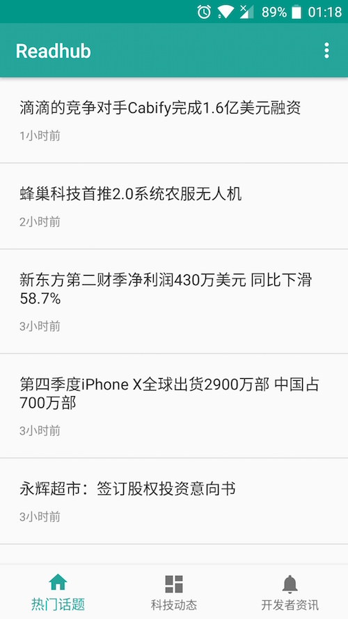

Screenshots
---
<figure class="half">

</figure>

概述
---
本项目为学习 Kotlin 练手而编写。纯学习所用，当然，平时坐地铁也是靠这个APP看新闻消磨时间。

此项目属于简洁风格，没有使用各种华丽的第三方库，基本都是用最基础的Android自带的API来使用。
第三方库只用了：
- Okhttp
- Gson
- threetenabp

自己封装了个网络请求框架 RhHttp，UI的BaseFragment、BaseAdapter。

代码复用度较高，做页面UI，请求数据，处理数据，展示，搞定。

TODO：
---
- 收藏夹 - 方便以后查找/查看用
- 评论 - 类似hacker news那样

---

**感谢[Readhub](https://readhub.me/)提供了这么优秀的数据来源**
